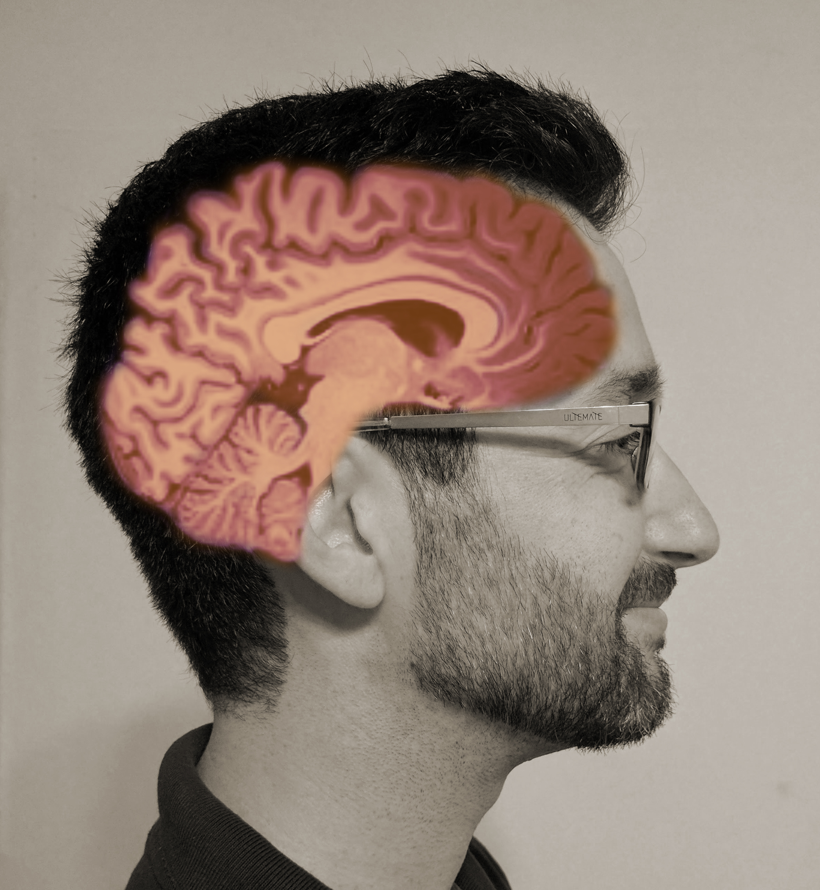

```{r setup, include=FALSE}
knitr::opts_chunk$set(echo = FALSE, warning = FALSE, message = FALSE)

# https://dktanwar.github.io/CV/ds.html
# https://fontawesome.com/v4.7.0/icons/
# https://github.com/jienagu/Jiena_McLellan_CV


DOI_link <- function(doi, sci_hub = TRUE){
  host <- if (sci_hub) "sci-hub.tw" else "doi.org"
  
  glue::glue("[DOI:{doi}](https://{host}/{doi})")
}
```

Aside
================================================================================


<!-- {width=80%} -->
{width=80%}


Contact Info {#contact}
--------------------------------------------------------------------------------

<i class="fa fa-envelope"></i> matanshm@post.bgu.ac.il  
<i class="fa fa-globe"></i> [Home Page](https://sites.google.com/view/mattansb) | <i class="fa fa-rss"></i> [Blog](https://shouldbewriting.netlify.com/)  
<i class="fa fa-github"></i> [GitHub](https://github.com/mattansb)  
<i class="fa fa-twitter"></i> [Twitter](https://twitter.com/mattansb) | <i class="fa fa-share-alt"></i> [ResearchGate](https://www.researchgate.net/profile/Mattan_Ben_Shachar)  
<i class="fa fa-id-badge"></i> [ORCID](https://orcid.org/0000-0002-4287-4801) | <i class="fa fa-graduation-cap"></i> [Google Scholar](https://scholar.google.co.il/citations?user=Vrbic5QAAAAJ&hl)

Skills {#skills}
--------------------------------------------------------------------------------

**Languages**: English (native), Hebrew (native).  
**Programming:** R, Matlab, E-Prime (See my [github profile](https://github.com/mattansb)).  
**Documentation:** Office Suites, Google Docs/Sheets, (R)Markdown.  
**Data analysis**: Statistical modeling, inference and visualization of survey, behavioral, and EEG data. Proficient in generalized linear / nonlinear mixed models, structural equation modeling, and their Bayesian equivalents.  

Disclaimer {#disclaimer}
--------------------------------------------------------------------------------

See [full CV](https://mattansb.github.io/CV/).

Last updated on `r Sys.Date()`.


Main
================================================================================

Mattan S. Ben-Shachar {#title}
--------------------------------------------------------------------------------

Currently a PhD student at Ben-Gurion University of the Negev. My research is focused on measuring individual differences in processing speed using electroencephalography (EEG) - a high temporal functional brain imaging technique.

I am an active R developer and science educator, and am very opinionated about data analysis, inferential statistics and reproducible research. I have provided support and consolation in these areas to numerous researchers.


Professional Experience {data-icon=laptop}
--------------------------------------------------------------------------------

### Data Analyst for the Social Sciences

N/A

N/A

2016 - Present

Consultation and data analysis for social sciences, primarily in R; Deeply rooted in theory and methodology, while also keeping in mind the practical needs of researchers and academics.

### R / Shiny Developer

N/A

N/A

2016 - Present

- Developer of [bayestestR](https://easystats.github.io/bayestestR/), a package for describingand testing posterior distributions and Bayesian models.
- Maintainer of [effectsize](https://cran.r-project.org/package=effectsize) for 
estimating indices of effect size and standardized parameters.  
- [cheatR](https://github.com/mattansb/cheatR), a mini package for measuring similarity between documents. Designed to catch students who hand in class-mates' work as their own. Also available as a [Shiny App](https://almogsi.shinyapps.io/cheatR/); Read the [blog post](https://shouldbewriting.netlify.com/posts/2018-07-29-cheatr/).  

### Research Management

N/A

N/A

2013 - Present

As part of [my research](https://mattansb.github.io/CV/#topics) I've had experience with planning and executing long-term research plans, working in- and managing teams, and conducting decision-guided statistical analyses.

### Teaching Experience

N/A

N/A

2015 - Present

Teaching and instructing has been focused on B.A. and M.A. level statistics, research methods and R.

*For a list of teaching topics, see [full CV](https://mattansb.github.io/CV/#teaching).*

Education {data-icon=graduation-cap data-concise=true}
--------------------------------------------------------------------------------

### Ph.D. in Psychology

Ben-Gurion University

Be'er Sheva, Israel

2017 - expected 2021

### M.A. in Experimental Cognitive Psychology

Ben-Gurion University

Be'er Sheva, Israel

2017

### B.A. in Behavioral Sciences

Ben-Gurion University

Be'er Sheva, Israel

2015