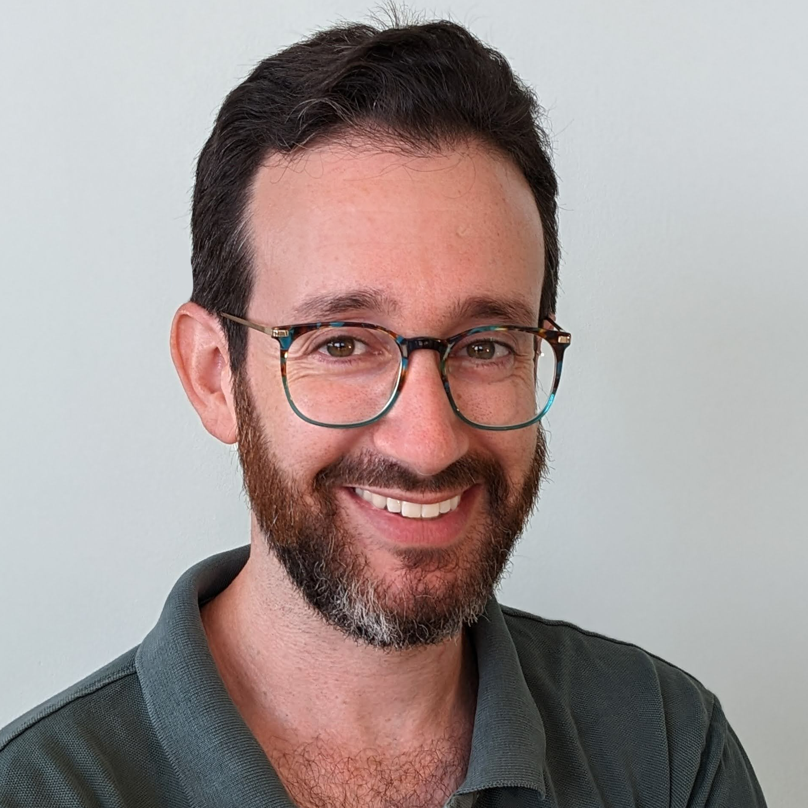

```{r setup, include=FALSE}
knitr::opts_chunk$set(echo = FALSE, warning = FALSE, message = FALSE)

# https://dktanwar.github.io/CV/ds.html
# https://fontawesome.com/v4.7.0/icons/
# https://github.com/jienagu/Jiena_McLellan_CV


DOI_link <- function(doi, sci_hub = TRUE){
  host <- if (sci_hub) "sci-hub.tw" else "doi.org"
  
  glue::glue("[DOI:{doi}](https://{host}/{doi})")
}
```

Aside
================================================================================


<center>

</center>


Contact Info {#contact}
--------------------------------------------------------------------------------

<i class="fa fa-envelope"></i> mattansb@msbstats.info  
<i class="fa fa-globe"></i> [Home Page](https://home.msbstats.info) | <i class="fa fa-rss"></i> [Blog](https://blog.msbstats.info/)  
<i class="fa fa-github"></i> [GitHub](https://github.com/mattansb) | <i class="fa fa-linkedin"></i> [LinkedIn](https://www.linkedin.com/in/mattan-s-ben-shachar)   
<i class="fa fa-twitter"></i> [Twitter](https://twitter.com/mattansb) | <i class="fa fa-cloud"></i> [BlueSky](https://bsky.app/profile/mattansb.bsky.social)  
<i class="fa fa-id-badge"></i> [ORCID](https://orcid.org/0000-0002-4287-4801) |
<i class="fa fa-graduation-cap"></i> [G-Scholar](https://scholar.google.co.il/citations?user=Vrbic5QAAAAJ&hl)  

<!-- <i class="fa fa-phone"></i> +972 50-837-1566   -->
<!-- <i class="fa fa-home"></i> 5 Dunash st., apt 27, Ramat-Gan   -->

Skills {#skills}
--------------------------------------------------------------------------------

**Languages**: English (native), Hebrew (native).  

**Programming:** R, Matlab, SQL, Stan, Python, Git(Hub) (See my [github profile](https://github.com/mattansb)).  

**Documentation:** Office Suites, (R)Markdown/Quatro, Google Docs/Sheets.  

**Research Analysis**: Statistical modeling, inference and visualization of survey, behavioral, and EEG data. Proficient in generalized linear / nonlinear mixed models, structural equation modeling, and their Bayesian equivalents.  

Disclaimer {#disclaimer}
--------------------------------------------------------------------------------

See [full CV](https://mattansb.github.io/CV/).

Last updated on `r Sys.Date()`.


Main
================================================================================

Mattan S. Ben-Shachar, PhD {#title}
--------------------------------------------------------------------------------

As a freelance [research analyst and statistical consultant](https://mattansb.github.io/CV/#stats-analyst) specializing in the social sciences, I offer comprehensive guidance throughout all stages of the research process, having provided support and consultation in these areas to numerous researchers, across several institutions. Holding a [PhD in neurocognitive psychology](https://mattansb.github.io/CV/#education) from Ben-Gurion University, I am deeply rooted in theoretical and applied statistics, and am committed to the principles of data analysis, inferential statistics, and reproducible research.

Concurrently, I am a [statistics educator](https://mattansb.github.io/CV/#teaching) at both Ben-Gurion University and Tel-Aviv University<!-- , teaching bachelor- and graduate-level statistics, research methods, and R programming, ranging from introductory statistics to applied machine learning -->. I supplement my goal of making statistics more accessible as an active [`R` developer](https://mattansb.github.io/CV/#R-dev), creating tools that aid in understanding statistical models.


Professional Experience {data-icon=laptop}
--------------------------------------------------------------------------------

### Statistical Consultant & Research Analyst

N/A

N/A

Since 2016

I am deeply rooted in theoretical and applied statistics, and am committed to the principles of data analysis, inferential statistics, and reproducible research, while also mindful of the practical needs of researchers and academics. I provide guidance throughout all stages of the research process and decision-guided statistical analyses.

*For more info and client testimonials, see [my home page](https://home.msbstats.info/stats-consultation).*

### Statistics Lecturer

N/A

N/A

Since 2015

My teaching and instructing are focused on bachelor- and graduate-level statistics, research methods, and R programming.

*See full list of [courses](https://mattansb.github.io/CV/#teaching).*

### R Developer

N/A

N/A

Since 2016

Core developer of the [*easystats* eco-system of packages](https://easystats.github.io/easystats/) --
an [award-winning](https://mattansb.github.io/CV/#awards) collection of R packages,
 aimed at making stats with R more accessible.

*See more on [GitHub](https://github.com/mattansb).*

Education {data-icon=graduation-cap data-concise=true}
--------------------------------------------------------------------------------

### Ph.D. in Psychology

Ben-Gurion University

Be'er Sheva, Israel

2023

**Thesis:** [*The Electrophysiological Basis of Processing Speed* <i class="fa fa-download"></i>](https://drive.google.com/uc?export=download&id=10NbOvivBrRQiCiioiR4g4X3xk3Msp0G_)  
**Supervisor:** Prof. Andrea Berger  

### M.A. in Experimental Cognitive Psychology

Ben-Gurion University

Be'er Sheva, Israel

2017

### B.A. in Behavioral Sciences

Ben-Gurion University

Be'er Sheva, Israel

2015